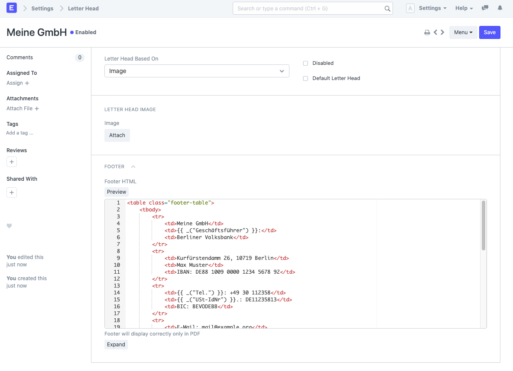
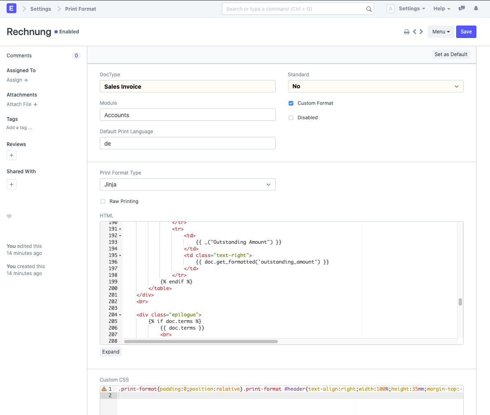

# ERPNext-Druckformate nach DIN 5008

> Für ERPNext v12

* `letter_head.html`: HTML und CSS für die Fußzeile.
* `print_style/print_style.scss`: Einheitliches CSS für alle Druckformate.
* `print_format/*.html`: HTML für den jeweiligen DocType.

## Abhängigkeiten

[Sass](https://sass-lang.com/install) wird benötigt, um das SCSS zu CSS zu kompilieren (`npm install -g sass` oder `brew install sass/sass/sass`).

Der folgende Befehl erzeugt die Datei `print_style.css` im Ordner `print_style`:

```
sass --style=compressed print_style/print_style.scss print_style/print_style.css
```

## Einrichtung

1. Neuen HTML-basierten **Letter Head** erstellen und den Inhalt von `letter_head.html` in das Feld "Footer HTML" kopieren.

    

2. **Company** öffnen und

   1. Den im vorigen Schritt erstellten **Letter Head** als "Default Letter Head" hinterlegen.
   2. Das Unternehmenslogo als "Profilbild" oben links hinzufügen. Dieses wird anstelle der Kopfzeile als Logo im Druckformat verwendet.
   3. Eine Adresse für das Unternehmen hinzufügen. Diese erscheint im Druckformat als Absender.

3. **Address Templates** für die Zielländer anlegen.
4. **Print Format** für **Quotation**, **Sales Invoice** und **Sales Order** anlegen. Hierzu den Inhalt der jeweiligen Datei aus dem Order `print_format` und das CSS aus `print_style/print_style.css` kopieren.

    

5. Über **Customize Form** das "Default Print Format" für den jeweiligen DocType hinterlegen


## Anpassung und Entwicklung

### Print Style

Es ist wichtig, dass möglichst jeder CSS-Block im Scope von `.print-format` und damit auf das Druckformat beschränkt ist. Andernfalls wirkt sicher der Stil auf das gesamte System aus.

### Jinja

Alle Druckformate sind [Jinja Templates](https://jinja.palletsprojects.com/en/2.11.x/templates/). Das heißt, es kann über das dictionary `doc` auf alle Felder des DocTypes zugegriffen werden. Bei Rechnungen steckt hinter `{{ doc.due_date }}` beispielsweise das Fälligkeitdatum und hinter `{{ doc.name }}` die Rechnungsnummer. Der Befehl `{{ doc.get_formatted('due_date') }}` gibt das Fälligkeitdatum (oder jedes andere Feld) schön formatiert aus (24.12.2020 statt 2020-12-24, € 10,00 statt 10.0, etc.).

Außerdem können einige Python- und Frappe-Funktionen genutzt werden. Beipielsweise hinterlegt `` alle Daten des zugehörigen Unternehmens in der variable `company`. Danach könnte beispielsweise die dort hinterlegte Website mit `{{ company.website }}` eingefügt werden.

Frappe stellt einige eigene Variablen wie `footer` oder `print_settings` zur Verfügung, die in jedem Print Format genutzt werden können. Eine Auflistung der verfügbaren Variablen findet sich hier: https://github.com/frappe/frappe/blob/4c6b58da2699189e6992707254f7a95f5c7df64a/frappe/www/printview.py#L148-L157 .

### Übersetzungen

Alle Dokumente sollten auf Deutsch und Englisch funktionieren.

Kurze Begriffe können mit `_('Translate me!')` übersetzt werden. Hierbei ist in der Regel der englische Begriff zu verwenden.

Sätze und längere Texte können per if-Statement übersetzt werden:

```jinja

    <p>Sehr geehrte Damen und Herren,<p>

    <p>Dear Sir or Madam,<p>

```

## Aktualisieren

Das Skript `update.py` kann genutzt werden, um automatisch alle Druckformate in ERPNext zu aktualisieren. Die Konstanten `ERPNEXT_URL` und `PRINT_FORMATS` müssen entsprechend des Zielsystems angepasst werden.

## Unterstützung erhalten

Wenn Sie Unterstützung bei der Anpassung der Druckformate benötigen, kontaktieren Sie uns gerne. Alle Kontaktdaten finden Sie auf [unserer Webseite](https://alyf.de).
